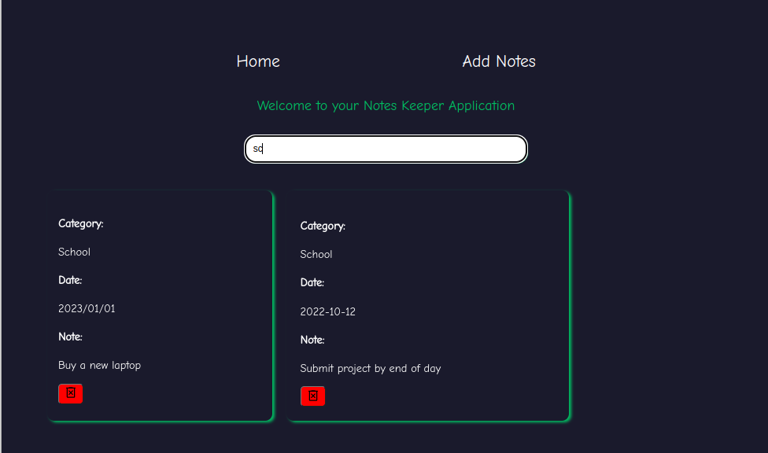
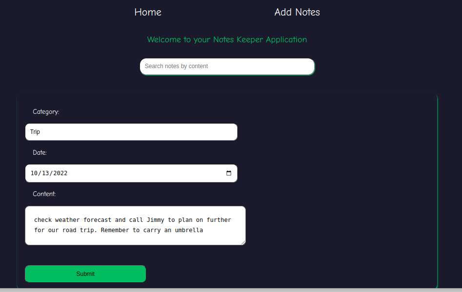
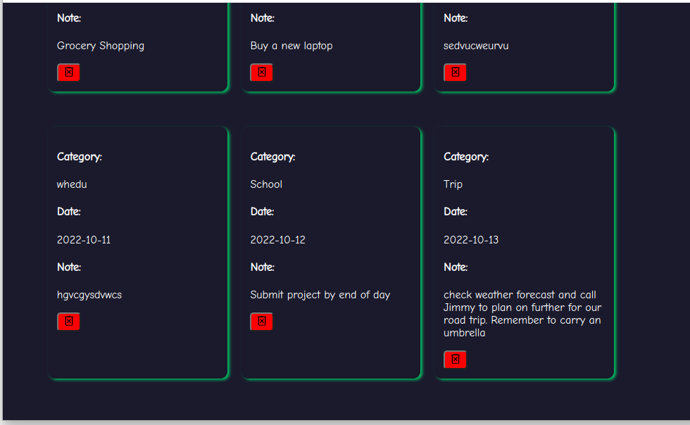
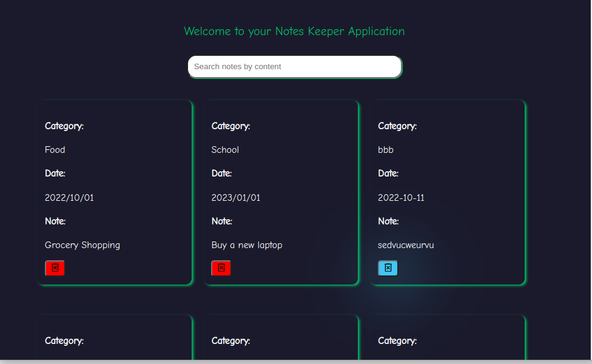

# About The Project:

            End of Phase 2 Project Assignment

## Project Name

            Notes Keeper 

## Author Details:

#### Name:
    Ian Mike Kaibi
#### Email: 
    ian.kaibi@student.moringaschool.com

Reach out on Twitter:

[Code Sketcher](https://twitter.com/Bit_Bytes_Bits)

## Table of Contents

- [Description](#description)
- [Project Build Up](#project-build-up)
- [Requirements](#requirements)
- [Program Setup](#program-setup)
- [Live Link](#live-link-to-project)
- [Project Images](#project-images)
- [License](#license-information)

## Description
Notes Keeper is an application written in `React JS` and styled in `CSS`.  
This is an apllication where a user is able to quickly take down notes on the go and save them for later.  
The application allows one to add their own custom category and in instances where notes are many  
you can quickly search through the app by the category used.

This project was bootstrapped with [Create React App](https://github.com/facebook/create-react-app).

### Available Scripts

In the project directory, you can run:

### `npm start`

Runs the app in the development mode.\
Open [http://localhost:3000](http://localhost:3000) to view it in your browser.

The page will reload when you make changes.\
You may also see any lint errors in the console.\
\
You can also view this project by clicking on the live link provided [here](#live-link-to-project).

## Project Build Up
    This project is built in React JS and styled in CSS. All dependancies required to run this apllication can be installed by running:
`npm install`

## Requirements
- A computer.  
* Visual studio code editor and these dependacies installed:  

          * React Router version 5.0.0. : if you are to make changes locally.
          * JSON Server.
          * Prettier formater.
          * Node JS should be installed prior to executing the codes on your computer.

* A working internet connection.

## Program Setup
1. Clone the repository to your computer using:

        git clone (link to repository)

2. Open the root of the folder on your visual studio code.

3. Run Live share and view the rendered page on your browser. 

## Live Link To Project:  

[Click here](https://brilliant-churros-7d83eb.netlify.app/)

## Project Images
Home Page
  

Search component
  

Input Form

Input Form

Delete Action

## License Information

The MIT License (MIT)
Copyright © 2022 [Ian Mike Kaibi](https://github.com/Bit-Bytes-Bits)  

Permission is hereby granted, free of charge, to any person obtaining a copy
of this software and associated documentation files (the "Software"), to deal
in the Software without restriction, including without limitation the rights
to use, copy, modify, merge, publish, distribute, sublicense, and/or sell
copies of the Software, and to permit persons to whom the Software is
furnished to do so, subject to the following conditions:

The above copyright notice and this permission notice shall be included in all
copies or substantial portions of the Software.

THE SOFTWARE IS PROVIDED "AS IS", WITHOUT WARRANTY OF ANY KIND, EXPRESS OR
IMPLIED, INCLUDING BUT NOT LIMITED TO THE WARRANTIES OF MERCHANTABILITY,
FITNESS FOR A PARTICULAR PURPOSE AND NONINFRINGEMENT. IN NO EVENT SHALL THE
AUTHORS OR COPYRIGHT HOLDERS BE LIABLE FOR ANY CLAIM, DAMAGES OR OTHER
LIABILITY, WHETHER IN AN ACTION OF CONTRACT, TORT OR OTHERWISE, ARISING FROM,
OUT OF OR IN CONNECTION WITH THE SOFTWARE OR THE USE OR OTHER DEALINGS IN THE
SOFTWARE.

Thank you.
